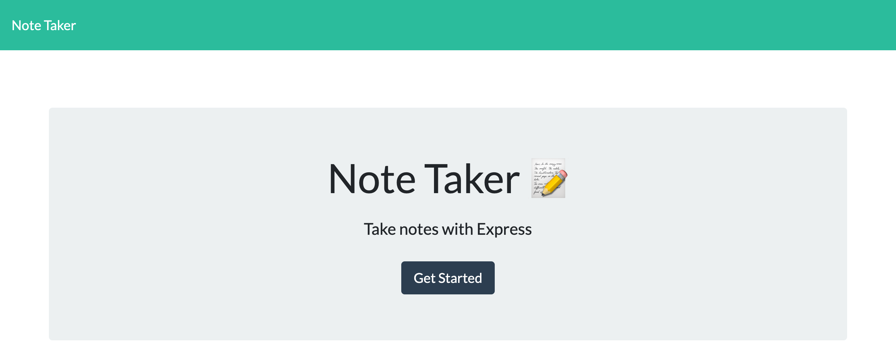
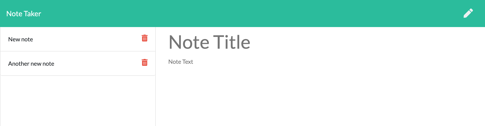
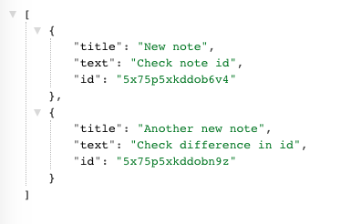

# Note Taker Application

## Description
An application that allows the user to create, save, and delete notes using an Express.js server. 

## Table of Contents
* [Installation](#installation)
* [Usage](#usage)
* [Built With](#builtwith)
* [Questions](#questions)
    
## Installation
Run npm install to install the required packages

## Usage
To write a new note, click on the pencil icon and an empty note will appear. To save a new note, enter a note title and the note text and click on the save icon. The new note will then be saved to the list of notes on the left. To delete a note, click on the trash icon.

Application on startup:

Notes page:

Notes API:

[Deployed Application](https://)

## Builtwith
* HTML
* CSS/Bootstrap
* JS
* Node
* Express.js
* Uniqid - NPM package

## Questions
Visit my Github
[d-belleza](https://github.com/d-belleza)

Additional questions, please send an email at
[davidbelleza@gmail.com](mailto:davidbelleza@gmail.com)